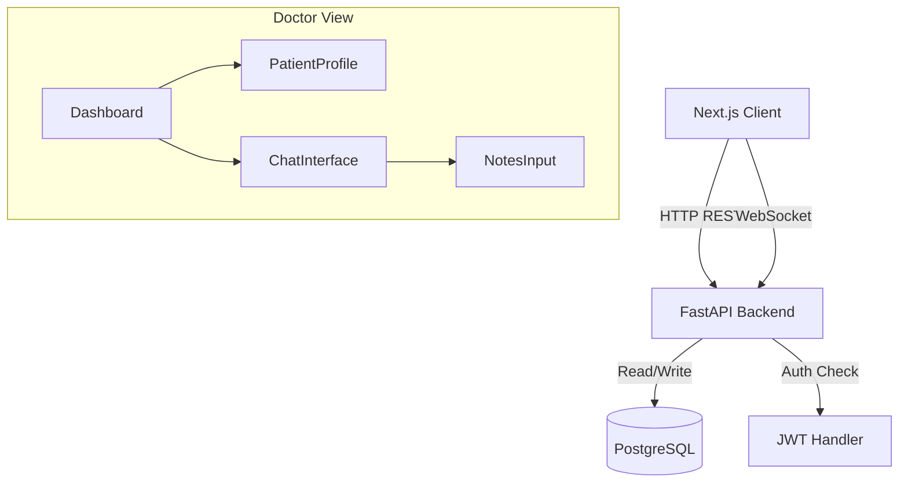

# Architecture Plan: CareConnect Live

## 1. Technology Stack
- **Frontend**: Next.js (React), Tailwind CSS (Mobile-first).
- **Backend**: FastAPI (Python).
- **Database**: PostgreSQL (via Supabase).
- **Auth**: JWT (handled by Backend) or Supabase Auth (simplified path). *Decision: Custom JWT via FastAPI for granular role control as requested.*

## 2. Component Architecture

### Frontend (Next.js)
-   **Pages**:
    -   `/login`, `/register`: Auth screens.
    -   `/patient/dashboard`: List of doctors, upcoming visits.
    -   `/doctor/dashboard`: Appointment list, availability settings.
    -   `/consultation/[id]`: The chat room & doctor workspace.
-   **Components**:
    -   `DoctorCard`: Display doctor info.
    -   `AppointmentRow`: List item for dashboard.
    -   `ChatWindow`: Real-time message list & input.
    -   `IntakeForm`: Pre-consultation questions.
    -   `PatientHistoryPanel`: Doctor's view of past records.

### Backend (FastAPI)
-   **Main App**: Setup middleware (CORS), DB connection.
-   **Routers**:
    -   `auth.py`: Login/Register logic.
    -   `users.py`: Profile management.
    -   `appointments.py`: Scheduling logic.
    -   `consultations.py`: Notes, summaries, chat history.
    -   `chat.py`: WebSocket endpoint for real-time messaging.

## 3. Architecture Diagram

## 4. Auth & Security
-   **Strategy**: Access Token (short-lived) + Refresh Token (HttpOnly cookie).
-   **RBAC**: Middleware to check `user.role` ('doctor' vs 'patient') on protected routes.
-   **Security**: Include `Depend(get_current_active_user)` on all private endpoints.

## 5. Error Handling & Logging
-   **Global Exception Handler**: Catch unhandled errors and return standard JSON error response.
-   **Logging**: Use Python `logging` module. Log requests (method/path) and errors with stack traces (in dev).
